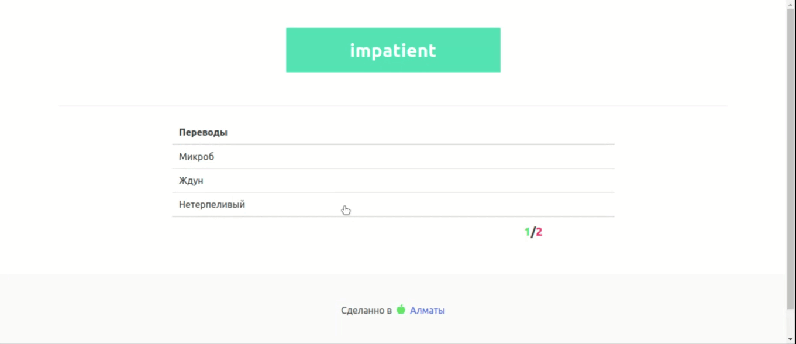

## Vocabulary Trainer

Простой тренажер слов на чисто javascript + bulma

Сборка проекта происходит с использованием [laravel-mix](https://laravel-mix.com/)

## Установка

Для запуска проекта понадобиться [NPM](https://www.npmjs.com/)

Клонируем репозиторий

    git clone https://github.com/Mhiggster/stackSlider.git app

Переходим в проект и устанавливаем

    cd app/ && npm install

Запускаем в нужном режиме

    npm run production | npm run dev | npm run watch

## Лицензия

[MIT](https://github.com/Mhiggster/VocabularyTrainer/blob/master/LICENSE)

Copyright (c) 2019-present, Miras Nurmukhanbetov